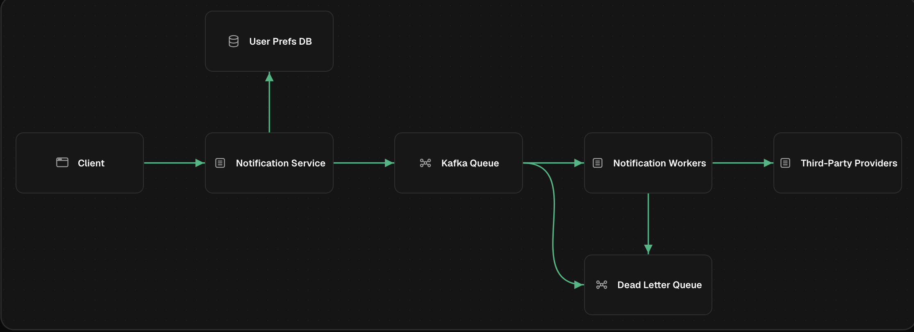

# Notification System

## Requirements

### Functional

- Multi channel support for notifications - (sms, email, push etc)
- User preference for specific channels
- Distinguish high priority notifications (OTP / 2FA code) from low priority notifications (recommendations, marketing)

### Non-Functional

- Reliable (at least once delivery) of notifications
- Scalable at load spikes (millions of marketing emails)
- high throughput and rate limit external vendors

## API Design

A service can call

```curl
POST /api/notifications
Body
{
  "userId": "user-123",
  "channel": "email",
  "content": {
    "subject": "Your order has shipped",
    "body": "Track your package at..."
  },
  "priority": "high"
}

Response
{
  "notificationId": "notif-456",
  "status": "queued"
}

Status: 202 Accepted
```

_202_ vs _200_ - the notification is not sent yet, only queued for processing

### Key fields

- `userId`: Who to notify
- `channel`: How to reach them (email, sms, push)
- `priority`: How urgent (high = OTP, low = marketing)
- `content`: What to send (templated or raw)

### Error cases

- `400` - invalid notification request
- `404` - user not found or pref not set
- `429` - too many requests for user / channel

## High-Level Design

- Overall architecture
  

## Components

### Notification service

- entry point for notification requests
- validates request, checks user pref from user pref DB
- drops notification early if user opted out of that notification
- pushes valid notifications to queue
- returns 202 created status

### User Preference DB

- stores preferences for users' notification channels
- can be cached in redis if user pref is mostly static

### Event Queue (Kafka)

- persistent store for messages to be delivered
- separate topics for priority: `notification-high`, `notification-low`

### Notification workers

- pulls messages from Kafka topics
- high priority workers consume from `notification-high` first
- calls the respective channel to send the notification
- retries up to a maximum limit with exponential backoff

### Third-party providers

- actual external APIs for sending notifications

### Dead Letter Queue

- messages that fail the retry limit are pushed to the DLQ
- malformed messages that can't be processed by workers are also pushed here
- prevents stuck messages from blocking the entire queue
- helps review and replay failed notifications

## Request flow

1. Order Service calls POST /api/notifications
2. Notification Service validates request
3. Check User Prefs DB: Is user opted-in? Not in DND?
4. If valid, publish to Kafka topic (high or low priority)
5. Return 202 Accepted to caller

--- async boundary ---

6. Worker pulls message from Kafka
7. Resolve template, format for channel (email/SMS/push)
8. Call third-party API (SendGrid, Twilio, FCM)
9. On success: mark as delivered
10. On failure: retry with exponential backoff (1s, 2s, 4s, 8s...)
11. After N failures: move to Dead Letter Queue (DLQ)

## Deep Dive

### Why queue events

- queue helps decouple the origin service from the notification service
- if any of the notification providers is down, the upstream service (like order service, payment service) is not blocked
- it just needs to push a message to the queue - the queue responds with a `202 - queued` response
- also helps control the flow of notifications

### Why separate priority queues

- single queue becomes a bottleneck - high priority OTP or order notification may get delayed due to millions of marketing emails
- different priority queues like `notification-high` and `notification-low` helps prevent this
- decouples the high vs low priority messages and processes higher ones immediately

### Why check user preference before queuing

- this helps filter out messages early
- prevents wasting worker capacity on messages that aren't meant to send

### Why a DLQ

- messages failing repeatedly upon retrying blocks the workers and prevents other messages from being processed
- DLQ provides a persistent store for stuck or malformed messages to be reviewed and retried later

### Fan out for large audiences

```text
Workers allocation:
  High Priority Pool: 10 workers  ->  notification-high topic
  Low Priority Pool:  5 workers   ->  notification-low topic

During normal load:
  High: processes OTP in <1 second
  Low:  processes marketing in ~5-30 seconds

During spikes (campaign notifications):
  High: still processes OTP in <1 second (separate pool!)
  Low:  backlog grows, workers process at their pace
```

We can also dynamically scale the low/high priority worker pools to absorb spike loads — e.g. if a campaign requires 2M emails, spin up additional low-priority workers until the backlog drains.

**Batching** — instead of queuing one message per recipient, we can batch campaign notifications, e.g. 2M recipients → 2,000 batches of 1,000 users each. Batches are processed in parallel across many workers.

### At least once delivery guarantee

Retries are more important than silently dropping notifications, so idempotent retries at the worker level become crucial.

- each channel worker uses a durable `notificationId` key to deduplicate against a persisted notification/session store on retry

This gives best-effort deduplication, but we can't fully avoid non-idempotent external API calls if a worker crashes after the provider has already sent the notification but before the outcome is recorded.

## Failure Handling

### 3 types of failures

1. Transient - provider timeouts, network error
2. Rate limit - external API limit exceeded (need to retry after limit resets)
3. Permanent failure - malformed request (can be immediately dropped or moved to DLQ)

For transient failures -> exponential backoff with jitter prevents thundering herd problems when a provider recovers:

For external APIs' rate limits, we need an internal rate limiter to prevent rate limiting or suspension by the external API

```text
Attempt 1: immediate
Attempt 2: 1 second + random(0-500ms)
Attempt 3: 2 seconds + random(0-500ms)
Attempt 4: 4 seconds + random(0-500ms)
Attempt 5: Dead Letter Queue
```

### Provider failover (what happens when a provider is down?)

If an external provider fails, we can use a circuit breaker to detect and fail over to another provider

```text
Primary provider: SendGrid
Fallback provider: SES

Flow:
1. Worker tries SendGrid
2. SendGrid returns 503 (down)
3. Circuit breaker trips after 5 consecutive failures
4. Worker switches to SES for email delivery
5. Background health check pings SendGrid periodically
6. When SendGrid recovers, circuit breaker resets
```

### Failure isolation

Each channel should fail independently - for eg sms provider down should not pull down the email or push notifications

Separate workers for different channels provides this isolation level

## Delivery status and Observability

Store notification status for observability:

```text
notification_id | user_id  | channel | status    | attempts | last_error
notif-456       | user-123 | email   | delivered | 1        | null
notif-789       | user-456 | sms     | failed    | 5        | Twilio timeout
notif-012       | user-789 | push    | dlq       | 5        | FCM invalid token
```

To update and maintain the status asynchronously, we use a separate status queue which different components write to.

For example:

- message in queue -> status `QUEUED`
- worker sends to provider -> status `SENT`
- provider responds -> status `DELIVERED`

---

## Design Walkthrough

> Interview-style narrated answer, written as if talking to an interviewer end-to-end.
